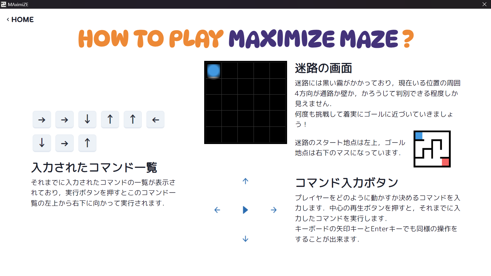

# MAXIMIZE MAZE

ソフトウェア開発論の授業で作成した迷路のアプリです．

作成されたゲームをプレイする場合は，Actionsの最新のコミットから自分のOSに対応したインストーラをダウンロードして実行してください．

コードから実行する場合は，`git clone`したディレクトリで`npm install`した後に，`npx tauri dev`でデバッグ，`npx tauri build`でインストーラ作成をしてください．
